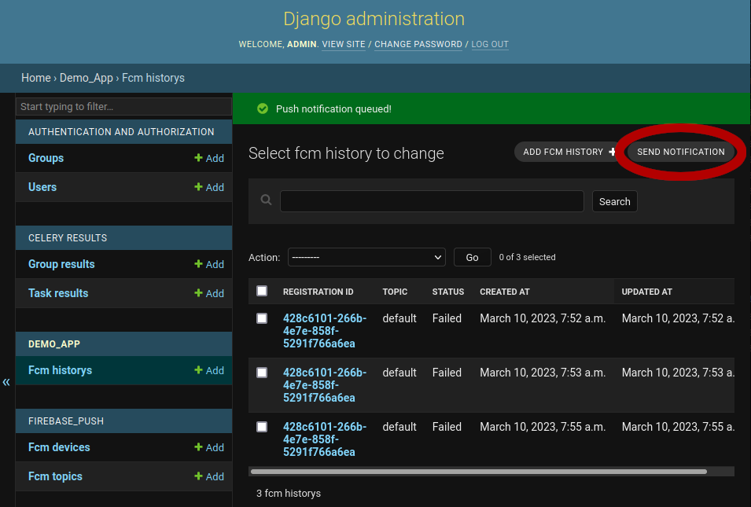

Firebase cloud messaging for Django with original Google SDK.

## Changelog

- 2023-03-10: Version `0.1.0`
  - First beta release
  - Standard push notifications
  - Localized push notifications
  - Sending in foreground and background with celery

## Installation

1. Requirements
  - Add `firebase_push` to your `requirements.txt`/`Pipfile`/`pyproject.toml`
  - Import the default settings at the end of your `settings.py`:
    ```python
    from firebase_push.conf.settings import *
    ```
  - Override default settings if needed (see next section)
2. URLs
  - Add urls to your `urlpatterns` in `urls.py`
    ```python
    from firebase_push.conf.urls import urlpatterns as firebase_push_urlpatterns

    urlpatterns += firebase_push_urlpatterns
    ```
3. Application
  - Add `firebase_push` and `rest_framework` to your `INSTALLED_APPS`
    ```python
    INSTALLED_APPS = [
        "firebase_push",
        "rest_framework",
        "admin_extra_buttons",
        ...
    ]
    ```
4. Add a `FCMHistory` class to your application:
  ```python
  from firebase_push.models import FCMHistoryBase

  class FCMHistory(FCMHistoryBase):
    pass
  ```
5. Point the setting `FCM_PUSH_HISTORY_MODEL` to that class path:
  ```python
  FCM_PUSH_HISTORY_MODEL = "demo.models.FCMHistory"
  ```
6. Run `manage.py makemigrations` and `manage.py migrate`
5. Do not forget to configure REST-Framework authentication (or supply CSRF
   Tokens when calling the API :S)

## Configuration

### Required

Set environment variable `GOOGLE_APPLICATION_CREDENTIALS` to the path to your
service account JSON file:

```bash
export GOOGLE_APPLICATION_CREDENTIALS=/path/to/service_account.json
```

#### To generate a private key file for your service account:

1. In the Firebase console, open **Settings** > [Service Accounts](https://console.firebase.google.com/project/_/settings/serviceaccounts/adminsdk).
2. Click **Generate New Private Key**, then confirm by clicking **Generate Key**.
3. Securely store the JSON file containing the key.

### Optional

- `FCM_USER_MODEL`: (path) override this if you need to attach anything other
  than the Django defined user model (configured by `settings.AUTH_USER_MODEL`)
  to your FCM device. (Note: if you override this, the user cannot be fetched
  from the session so you'll need to override the next option too.)
- `FCM_FETCH_USER_FUNCTION`: (path) path to the function to call in your code
  to fetch a user id to attach to the request. Will be called with the Django
  `request` as single parameter, expected to return an id to a DB model
  instance of `FCM_USER_MODEL`.


## Running

If you send your push notifications without `sync=True` you will need a running
celery worker.

To configure celery you will need at least the following in your `settings.py`

```python
# Celery broker URL for redis transport
CELERY_BROKER_URL = f"redis://localhost:6379/1"
```

To start the celery worker user something like this:

```bash
export GOOGLE_APPLICATION_CREDENTIALS=serviceaccount.json # Point this to the google service account
export DJANGO_SETTINGS_MODULE=demo.settings.native # Point this to your config
celery --app demo worker # demo here stands as placeholder for your application
```

To send Push Notifications manually there is an extra button in the Django admin for the `FCMHistory` class:



## API Endpoints for devices

- `firebase-push/`: registration endpoint, call this on app-activation

Payload:

```json
{
	"registration_id": "<fcm_token>",
	"topics": [ "default" ],
	"platform": "ios",
	"app_version": "2.0"
}
```

- `registration_id`: FCM Token from Firebase SDK
- `topics`: List of topics to subscribe to. If left out defaults to `default`
- `platform`: app platform, one of `android`, `ios`, `web`, if left out defaults to `unknown`
- `app_version`: app version string, if left out defaults to empty string

Reply:

```json
{
	"registration_id": "<FCM token>",
	"topics": [
		"default"
	],
	"platform": "ios",
	"app_version": "2.0",
	"created_at": "2023-01-30T15:20:44.265191",
	"updated_at": "2023-01-30T15:20:44.265208"
}
```

You may `POST` new values, autentication for the user is handled by REST-Framework. If the user of the registration
changes, the old registration is removed and a new one is created. This is done to avoid receiving notifications of
other users when frequently switching accounts while testing the app.

To update for example the subscribed topics you may call `PATCH` on the endpoint with appended registration ID (like
`firebase-push/<bla>`) and only specify the changed values in the payload. If the registration is currently recorded
for a different user, the old registration will be removed as with `POST`. Calling the endpoint with `PATCH` is possible
but the utility of this is limited, better stick to `POST` and include all values to make sure everything is recorded
in the DB correctly.

If you call the endpoint with `GET` you will get a list of all registrations of the current user.

If you call the endpoint with `DELETE` and appended registration ID (like `firebase-push/<bla>`) the push registration
will be deleted from the server if the current user owns it and you will receive a `204 No Content` response.

## DB Models

There are 3 Models of which one is an abstract model.

1. `FCMDevice`: The device registration, contains FCM tokens and some metadata about the device
2. `FCMTopic`: A topic for which a device can register. Can be used to filter which messages to send to which devices
3. `FCMHistory` aka `FCMHistoryBase`: This is the abstract model for the push notification history. You can add your
  own fields to this to save additional information about a message.

### `FCMDevice`

- `registration_id` the FCM Token
- `user` user to which this device belongs, devices will cascade delete with this user
- `topics` topics which the device subscribes to
- `platform` platform as reported by the device on registration, one of `android`, `ios`, `web`, `unknown`
- `app_version` stringified application version as reported by device
- `created_at`, `updated_at`, `disabled_at` some dates used by the cleanup scripts

### `FCMHistoryBase`

- `message_id` internal UUID to identify messages that were sent in one batch
- `message_data` JSON data that was sent to firebase
- `device` device this message was sent to (will be set to `None` if the device is removed)
- `user` the user that this message was sent to (will cascade delete the history if removed)
- `topic` optional: topic this message was sent to
- `status` one of `pending`, `sent`, `failed`
- `error_message` if `status` is failed this contains the error message
- `created_at`, `updated_at` some dates used by the cleanup scripts

## On overriding `FCMHistoryBase`:

if you override the history class to add custom data to it, it is probably a good idea to override the
`PushMessage` classes too to hook into history item creation:

```python
# Data model
from django.db import models
from firebase_push.models import FCMHistoryBase

class FCMHistory(FCMHistoryBase):
  foobar = models.CharField(max_length=255, null=False, blank=False)

# Push message override
from typing import Any
from firebase_push.message import PushMessage

class MyPushMessage(PushMessage):

  def __init__(self, title: str, body: str, link: Optional[str]=None, foobar: str="nothing"):
    super().__init(title, body, link=link)
    self.foobar = foobar

  def serialize(self) -> dict[str, Any]:
    result = super().serialize()
    result.update(dict(
      foobar=self.foobar
    ))
    return result

  def deserialize(self, data: dict[str, Any]):
    super().deserialize(data)
    self.foobar = data['foobar']

  def create_history_entries(self, *args, **kwargs) -> list[FCMHistory]:
    entries = super().create_history_entries(*args, **kwargs)

    for entry in entries:
      entry.foobar = self.foobar
    
    return entries
```

## Message sending

To send a message use one of the `PushMessageBase` subclasses like provided:

- `PushMessage`: Basic push message class, no i18n logic
- `LocalizedPushMessage`: Push message with i18n logic

Basic interface is like this:

```python
from firebase_push.message import PushMessage

msg = PushMessage("Title", "body text", link="http://google.com")
msg.add_user(some_user)
msg.add_topic('test')
msg.send()
```

This will send the message to all devices registered to the user `some_user` that subscribe the `test` topic.
Sending will be performed in the background via Celery task. The celery task will update the automatically
created `FCMHistory` object once it has been processed. If you send to a topic that does not exist it is created on the
spot, but will then of course reach no device.

There are optional additional attributes you may set for a message:

Common attributes:

- `collapse_id`: If multiple messages with this ID are sent they are collapsed
- `badge_count`: Badge count to display on app icon, may not work for all android devices, set to 0 to remove badge
- `data_available`: Set to `True` to trigger the app to be launched in background for a data download.
- `sound`: Play a sound for the notification, set to `default` to play default sound or to name of sound file in
  app-bundle otherwise.
- `data`: Custom dictionary of strings to append as data to the message

Android specific:

- `android_icon`: Icon for the notification
- `color`: CSS-Style Hex color for the notification
- `expiration`: Date until which the message is valid to be delivered
- `is_priority`: Set to `True` to make it a priority message

Web specific:

- `web_actions`: Actions for the push notifications, is a tuple: `("title", "action", "icon")`
- `web_icon`: Icon for the notification

### `LocalizedPushMessage`

To send a localizable push message you can use Android style format strings and replacement parameters.
Web-Push notifications do not have a local stored translation table so they will be sent by using Django's
translation facilities, so make sure to set the correct language environment before sending a message.

To create a localization for the Web-Push strings convert them to python `.format()` style strings and add
them to the gettext `.po` file.

Basic interface works like this:

```python
from firebase_push.message import PushMessage

msg = PushMessage(
  "Title with %s",
  "body number %d, string: %s",
  link="http://google.com"
  title_args=["placeholders"],
  body_args=[10, 'a string']
)
msg.add_user(some_user)
msg.add_topic('test')
msg.send()
```

For testing you can use `msg.send(sync=True)` to send the message immediately without involving celery

This will send a translateable message. The clients have to have translation tables.

- Android needs just `Title with %s` and `body number %d, string: %s` in the strings
- iOS will use something like `Title with %@` and `body number %@, string: %@`
- For Django/Web you will need `Title with {:s}` and `body number {:d}, string: {:s}`

It is possible to add positioning hints:

- Android `%1$s` and `%2$d` to declare parameters as first and second
- iOS will have it replaced with `%1$@` and `%2$@`
- For Django/Web use `{1:s}` and `{2:s}`

There are some additional attributes:

Apple specific:

- `action_loc`: Identifier for the action item that is displayed (optional, will not display an action if undefined)

Web specific:

- `web_actions`: `action` and `title` should be translatable strings or translation identifiers

## Cleanup

Automatic cleanup of outdated device registrations and push notification history works by calling management commands.
By default history is removed after 6 months, device registrations are _disabled_ after 2 months as per recommendation
from google. Disabled devices are removed after them being disabled for 2 months.

- `python manage.py age_devices [-s <days>]`
- `python manage.py cleanup_devices [-s <days>]`
- `python manage.py cleanup_history [-s <days>]`

Attention: As `firebase_push` does not control what is saved in the push notification history the `cleanup_history`
command may fail on unknown database constraints. Please duplicate the management command if that may happen with your
implementation.
